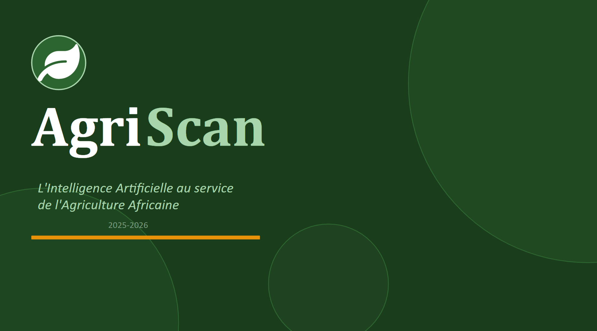
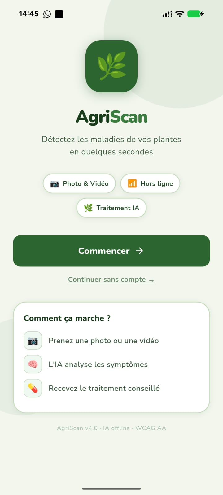
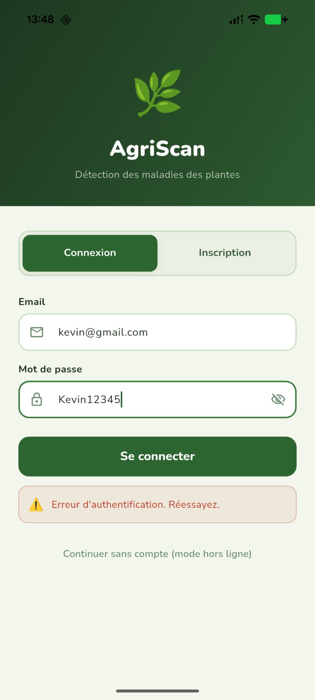
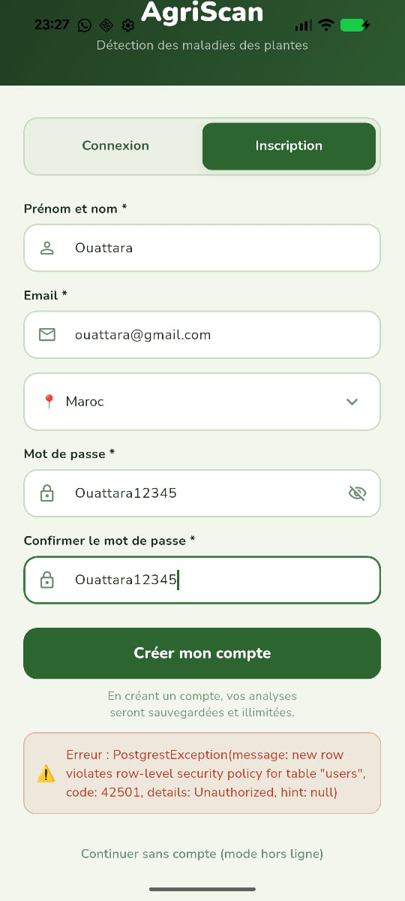
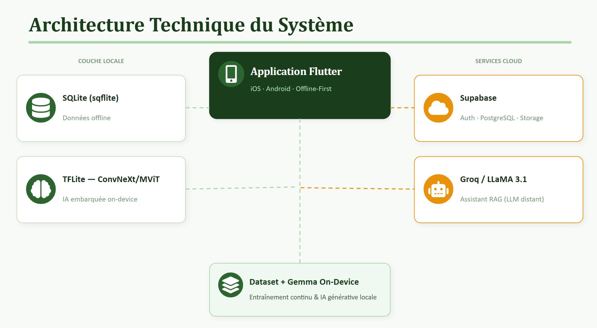
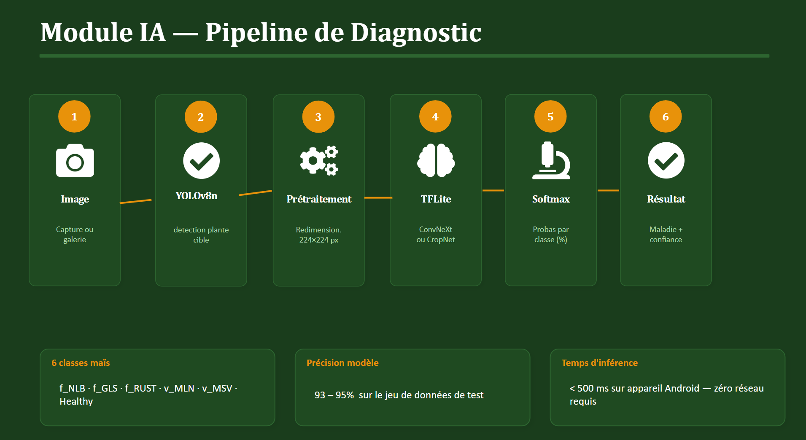

<div align="center">



## 🎥 AgriScan Demo

[](https://www.youtube.com/watch?v=S7GikMVS7Gc)

# 🌿 AgriScan
### Intelligent Crop Disease Detection — Powered by AI & Drone Vision

[](https://flutter.dev)
[](https://www.tensorflow.org/lite)
[](https://supabase.io)
[](LICENSE)
[](https://stic26.com)

**Sahal Tech Innovation Challenge 2026 — Candidature Individuelle**

[Voir la démo](#démonstration) · [Fonctionnalités](#fonctionnalités) · [Architecture IA](#intelligence-artificielle) · [Impact](#impact)

</div>

---

## 📖 À propos

AgriScan est né d'une réalité vécue sur le terrain.

> *"J'ai grandi dans une famille d'agriculteurs. À chaque saison, mes parents pulvérisaient l'intégralité du champ sans savoir exactement quelle maladie l'affectait, ni où elle se trouvait. Faute d'accès à un agronome, les conseils circulaient de bouche à oreille — et se déformaient. Les mauvais produits, les mauvaises doses, les mauvaises zones traitées. Des pertes évitables."*

**AgriScan** transforme un smartphone ordinaire — ou un drone — en expert agricole de poche. Grâce à l'intelligence artificielle embarquée, chaque agriculteur peut diagnostiquer ses cultures en quelques secondes, obtenir des recommandations précises et commander les bons traitements, même sans connexion Internet.

---

## 🔴 Le Problème

L'agriculture africaine fait face à trois défis majeurs qui réduisent les rendements chaque année :

| Défi | Conséquence |
|------|-------------|
| **Diagnostic tardif ou absent** des maladies | 30% des récoltes perdues faute de détection précoce |
| **Traitement à l'aveugle** de tout le champ | Gaspillage de produits chimiques + pollution environnementale |
| **Manque d'accès aux conseils experts** | Informations erronées transmises entre agriculteurs |

> Ces trois problèmes réunis coûtent **5 milliards de dollars** de pertes agricoles annuelles en Afrique subsaharienne.

---

## 💡 La Solution — AgriScan

AgriScan est une **application mobile intelligente** qui combine vision par ordinateur, intelligence artificielle et marketplace agricole pour offrir une solution complète, du diagnostic au traitement.

```
📸 Photo ou 🚁 Drone  →  🧠 IA on-device  →  📋 Diagnostic  →  💊 Traitement  →  🛒 Achat
```

**Ce qui rend AgriScan unique :**
- ✅ Fonctionne **sans connexion Internet** (IA embarquée sur le téléphone)
- ✅ Utilisable par **tout agriculteur** avec un smartphone basique
- ✅ **Analyse par drone** pour les grandes exploitations (cartographie précise)
- ✅ Lien direct **diagnostic → achat du bon traitement** en un clic
- ✅ **Assistant agronome IA** disponible 24h/24

---

## 🚁 Comment ça marche

### Version Smartphone — Usage quotidien

```
┌─────────────────────────────────────────────────────────────┐
│                                                             │
│   1. L'agriculteur prend une photo de la feuille suspecte  │
│                          ↓                                  │
│   2. L'IA analyse l'image en moins de 500ms (sur appareil) │
│                          ↓                                  │
│   3. La maladie est identifiée avec un indice de confiance  │
│                          ↓                                  │
│   4. Des recommandations de traitement sont générées        │
│                          ↓                                  │
│   5. L'agriculteur commande les produits depuis l'app       │
│                                                             │
└─────────────────────────────────────────────────────────────┘
```

### Version Drone — Agriculture de précision 🚁

C'est le **point fort d'AgriScan** pour les grandes exploitations.

```
┌─────────────────────────────────────────────────────────────┐
│                                                             │
│   1. Le drone survole le champ et capture une vidéo HD      │
│                          ↓                                  │
│   2. AgriScan importe la vidéo et l'analyse image par image │
│                          ↓                                  │
│   3. L'IA détecte les zones malades avec leur localisation  │
│                          ↓                                  │
│   4. Une carte thermique des zones infectées est générée    │
│                          ↓                                  │
│   5. Seules les zones affectées sont traitées → économies   │
│                          ↓                                  │
│   6. Un plan de traitement ciblé par drone est proposé      │
│                                                             │
└─────────────────────────────────────────────────────────────┘
```

**Bénéfices directs du module drone :**
- 🎯 Traitement ciblé → jusqu'à **60% de réduction** des produits chimiques utilisés
- 🗺️ Cartographie précise → visualisation exacte des zones infectées
- ⏱️ Gain de temps → analyse d'un champ de 10 hectares en quelques minutes
- 🌍 Impact environnemental réduit → moins de pollution, moins de coûts

---

## 🧠 Intelligence Artificielle

### Modèle de détection

AgriScan utilise un modèle de deep learning nommé **CropNet**, spécialement entraîné sur des images de cultures africaines (Maize Imagery Dataset — Tanzanie).

```
Image de feuille
      ↓
Redimensionnement (224×224 px)
      ↓
Modèle CropNet (ConvNeXt fine-tuné)
      ↓
Classification : 6 classes
      ↓
R�sultat + confiance (%)
```

### Ce que l'IA détecte sur le maïs

| Code | Maladie | Description |
|------|---------|-------------|
| `f_NLB` | Helminthosporiose | Taches brunes allongées sur les feuilles |
| `f_GLS` | Cercosporiose grise | Lésions rectangulaires grises/brunes |
| `f_RUST` | Rouille commune | Pustules orange-brun sur les feuilles |
| `v_MLN` | Nécrose létale | Maladie virale — jaunissement + nécrose |
| `v_MSV` | Striure du maïs | Stries jaunes le long des nervures |
| `Healthy` | Plante saine | Aucune maladie détectée |

### Performances du modèle

```
Précision globale :  93 – 95%
Temps d'inférence : < 500 ms (sur appareil Android)
Taille du modèle :  ~15 MB (optimisé TensorFlow Lite)
Connexion requise : Aucune (100% on-device)
```

### Pipeline de développement IA

```
Données (Kaggle + Roboflow)
    → EDA & Nettoyage
    → Augmentation (×6 images)
    → Entraînement 3 phases (transfer learning)
    → Évaluation (matrice de confusion + Grad-CAM)
    → Export .tflite
    → Intégration Flutter
```

### Assistant Agronome (RAG)

Au-delà de la détection, AgriScan intègre un **assistant conversationnel intelligent** :
- Répond aux questions agricoles en langage naturel
- Alimenté par **Groq / LLaMA 3.1** + base de connaissances locale
- Fonctionnement hors-ligne via **flutter_gemma** (IA générative on-device)
- Anti-hallucination : les réponses sont ancrées sur des fiches agronomiques vérifiées

---

## ✨ Fonctionnalités Principales

### 🔬 Diagnostic IA
- Capture photo ou import galerie
- Analyse vidéo drone image par image
- Résultat en < 500ms sans connexion
- Indice de confiance + niveau de sévérité
- Historique complet des analyses

### 🗺️ Cartographie & Drone
- Visualisation des zones infectées sur carte
- Analyse vidéo drone automatique
- Simulation de traitement ciblé par drone
- Rapport par zone géolocalisée

### 💬 Assistant Agronome IA
- Chatbot en langue naturelle (français)
- Contexte personnalisé (région, culture, saison)
- Fonctionne hors-ligne
- Base de connaissances agronomiques intégrée

### 🛒 Marketplace Agricole
- Catalogue de produits phytosanitaires (fongicides, pesticides, bio)
- Recommandation automatique selon la maladie détectée
- Commande directe avec livraison
- Historique des commandes

### 👤 Profil & Personnalisation
- Configuration du contexte agricole (région, culture, sol, climat)
- Tableau de bord de l'exploitation
- Modèle freemium (15 analyses gratuites, illimité après inscription)
- Mode hors-ligne complet

---

## 📱 Démonstration

### Écrans principaux

> **📁 Déposer les captures dans le dossier `images/` du dépôt GitHub**

---

#### Onboarding & Authentification

| Écran | Fichier à déposer |
|-------|-------------------|
| Splash screen / Logo | `images/screens/splash.png` |
| Page de connexion | `images/screens/login.png` |
| Page d'inscription | `images/screens/register.png` |
| Mode invité | `images/screens/guest.png` |


  

---

#### Dashboard & Navigation

| Écran | Fichier à déposer |
|-------|-------------------|
| Écran d'accueil / Home | `images/screens/home.png` |
| Menu latéral (Drawer) | `images/screens/drawer.png` |
| Tableau de bord | `images/screens/dashboard.png` |
| Profil utilisateur | `images/screens/profile.png` |
| Contexte agricole | `images/screens/context.png` |


---

#### Diagnostic IA — Cœur de l'application

| Écran | Fichier à déposer |
|-------|-------------------|
| Scanner / Capture photo | `images/screens/scanner.png` |
| Écran d'analyse en cours | `images/screens/analyzing.png` |
| Résultat du diagnostic | `images/screens/result.png` |
| Résultat — maladie détectée | `images/screens/result_disease.png` |
| Résultat — plante saine | `images/screens/result_healthy.png` |
| Sélection du modèle IA | `images/screens/model_selector.png` |


---

#### Analyse Vidéo Drone 🚁

| Écran | Fichier à déposer |
|-------|-------------------|
| Import vidéo drone | `images/screens/drone_import.png` |
| Analyse vidéo en cours | `images/screens/drone_analyzing.png` |
| Résultats vidéo (liste) | `images/screens/drone_results.png` |
| Carte des zones infectées | `images/screens/field_map.png` |
| Simulation traitement drone | `images/screens/drone_simulation.png` |


---

#### Historique & Suivi

| Écran | Fichier à déposer |
|-------|-------------------|
| Liste de l'historique | `images/screens/history.png` |
| Détail d'une analyse | `images/screens/history_detail.png` |
| Recommandations | `images/screens/recommendations.png` |


---

#### Assistant Agronome IA

| Écran | Fichier à déposer |
|-------|-------------------|
| Écran de chat | `images/screens/chat.png` |
| Conversation en cours | `images/screens/chat_conversation.png` |
| Historique des conversations | `images/screens/chat_history.png` |
| Base de connaissances | `images/screens/knowledge_base.png` |


---

#### Marketplace Agricole

| Écran | Fichier à déposer |
|-------|-------------------|
| Catalogue produits | `images/screens/marketplace.png` |
| Détail d'un produit | `images/screens/product_detail.png` |
| Panier | `images/screens/cart.png` |
| Formulaire de commande | `images/screens/order_form.png` |
| Confirmation commande | `images/screens/order_confirmation.png` |
| Historique des commandes | `images/screens/orders_history.png` |


---

### Schéma de l'architecture

> Déposer : `images/architecture.png`



### Pipeline IA

> Déposer : `images/ai_pipeline.png`



### Carte des zones infectées (résultat drone)

> Déposer : `images/drone_map.png`


---

## 🛠️ Technologies Utilisées

### Application Mobile
| Technologie | Rôle |
|-------------|------|
| **Flutter / Dart** | Framework mobile multiplateforme (iOS + Android) |
| **SQLite (sqflite)** | Base de données locale — fonctionne hors-ligne |
| **Supabase** | Backend cloud (auth, PostgreSQL, Storage) |

### Intelligence Artificielle
| Technologie | Rôle |
|-------------|------|
| **Python / Keras** | Entraînement du modèle de détection |
| **ConvNeXt / MobileViT** | Architectures deep learning testées |
| **TensorFlow Lite** | Inférence embarquée sur mobile |
| **flutter_gemma** | IA générative on-device (Gemma LLM) |
| **Groq + LLaMA 3.1 8B** | Assistant agronome conversationnel |

### Données & Outils
| Technologie | Rôle |
|-------------|------|
| **Kaggle** | Dataset source (Maize Imagery Dataset) |
| **Roboflow** | Annotation et augmentation des données |
| **Git / GitHub** | Versioning et collaboration |

---

## 📁 Structure du Projet

```
agriscan/
│
├── lib/
│   ├── screens/          # Tous les écrans de l'application
│   │   ├── scanner_screen.dart
│   │   ├── disease_result_screen.dart
│   │   ├── marketplace_screen.dart
│   │   ├── chat_screen.dart
│   │   ├── history_screen.dart
│   │   ├── field_map_screen.dart
│   │   ├── drone_simulation_screen.dart
│   │   └── video_analysis_screen.dart
│   │
│   ├── services/         # Logique métier (singletons)
│   │   ├── ml_service.dart         # IA embarquée TFLite
│   │   ├── database_service.dart   # SQLite local
│   │   ├── chat_service.dart       # Assistant RAG
│   │   ├── marketplace_service.dart
│   │   └── supabase_service.dart
│   │
│   └── theme/            # Design system (couleurs, polices)
│
├── assets/
│   └── models/           # Modèles TFLite embarqués
│       ├── cropnet_maize.tflite
│       └── yolov8n_plants.tflite
│
├── android/              # Configuration Android
├── ios/                  # Configuration iOS
│
└── images/               # ← DÉPOSER VOS CAPTURES ICI
    ├── logo.png
    ├── architecture.png
    ├── ai_pipeline.png
    ├── drone_map.png
    └── screens/
        ├── splash.png
        ├── login.png
        ├── home.png
        ├── scanner.png
        ├── analyzing.png
        ├── result.png
        ├── result_disease.png
        ├── drone_import.png
        ├── drone_results.png
        ├── field_map.png
        ├── drone_simulation.png
        ├── history.png
        ├── recommendations.png
        ├── chat.png
        ├── marketplace.png
        ├── product_detail.png
        ├── cart.png
        ├── order_confirmation.png
        └── ...
```

---

## 🎯 Impact & Objectifs

### Impact immédiat

```
┌─────────────────────────────────────────────────────────────┐
│                                                             │
│   🌱 Pour l'agriculteur                                     │
│      → Diagnostic en 30 secondes au lieu de 72 heures      │
│      → Accès à un agronome expert 24h/24, gratuitement      │
│      → Réduction des pertes de récoltes jusqu'à 30%        │
│                                                             │
│   🌍 Pour l'environnement                                   │
│      → Jusqu'à 60% de pesticides en moins (traitement ciblé)│
│      → Moins de pollution des sols et des nappes phréatiques│
│                                                             │
│   💰 Pour l'économie agricole                               │
│      → Accès direct aux bons produits de traitement        │
│      → Réduction des pertes économiques (5 Mds$/an Afrique) │
│                                                             │
└─────────────────────────────────────────────────────────────┘
```

### Qui peut utiliser AgriScan ?

| Profil | Usage |
|--------|-------|
| **Petit agriculteur** | Diagnostic via smartphone, conseils immédiats |
| **Grande exploitation** | Analyse drone, cartographie, traitement ciblé |
| **Coopérative agricole** | Tableau de bord commun, historique partagé |
| **Fournisseur de produits** | Accès marketplace, gestion des commandes |

---

## 🔮 Perspectives Futures

### Court terme
- [ ] Extension au modèle tomate (11 maladies)
- [ ] Paiement mobile intégré (Orange Money, Wave)
- [ ] Validation du module YOLO sur données terrain réelles

### Moyen terme
- [ ] Extension à d'autres cultures (blé, sorgho, pomme de terre)
- [ ] Géolocalisation GPS précise des zones infectées
- [ ] Application web pour agronomes et coopératives
- [ ] Certification et partenariats avec ministères agricoles

### Long terme
- [ ] Intégration avec flux drone temps réel (streaming)
- [ ] Modèle IA réentraîné sur données terrain collectées en continu
- [ ] Déploiement dans plusieurs pays d'Afrique subsaharienne
- [ ] API ouverte pour développeurs et institutions agricoles

---

## 🏗️ Installation & Lancement

```bash
# Cloner le dépôt
git clone https://github.com/votre-username/agriscan.git
cd agriscan

# Installer les dépendances
flutter pub get

# Lancer l'application
flutter run --android-skip-build-dependency-validation
```

> **Prérequis** : Flutter 3.44+, Dart 3.10+, Android SDK, compte Supabase configuré

---

## 👤 Auteur

<div align="center">

**Projet individuel — Sahal Tech Innovation Challenge 2026**

| | |
|--|--|
| **Nom** | *[Votre nom complet]* |
| **Filière** | Génie Informatique |
| **Spécialité** | Intelligence Artificielle & Développement Mobile |
| **GitHub** | [@votre-username](https://github.com/votre-username) |
| **Email** | votre.email@example.com |
| **Pays** | Maroc 🇲🇦 |

</div>

---

## 📄 Licence

Ce projet est soumis dans le cadre du **Sahal Tech Innovation Challenge 2026 (STIC'26)**.

Distribué sous licence MIT — voir le fichier [LICENSE](LICENSE) pour plus de détails.

---

<div align="center">

**AgriScan** — *L'Intelligence Artificielle au service de l'Agriculture Africaine*

🌿 *Diagnostiquer · Recommander · Traiter · Livrer*

Made with ❤️ for African Farmers

</div>
